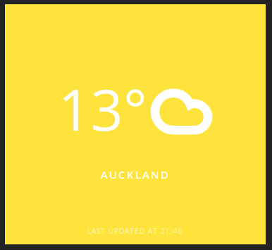

## Description

[Dashing-js](http://fabiocaseri.github.com/dashing-js) widget to display weather from [NIWA Weather](http://weather.niwa.data) using [Climacons Font](http://adamwhitcroft.com/climacons/font/). Also the background of the widget automatically changes to the current temperature outside.

Ported from [@danillotuhumury's work](https://github.com/danillotuhumury/klimato-dashing-widget) and [@fabiocaseri's work](https://github.com/fabiocaseri/klimato-dashing-js-widget)

## Installation

```shell
$ dashing-js install https://github.com/kinow/niwaweather-dashing-js-widget/archive/master.zip
```

##Usage

To include the widget into your dashboard add the following code:

```html
    <li data-row="1" data-col="1" data-sizex="1" data-sizey="1">
      <div data-id="niwaweather" data-view="Niwaweather"></div>
    </li>
```

##Settings

Adjust the widget to your desired location by editing the location in the jobs file. (You can lookup your Location here: http://weather.niwa.co.nz)

##Preview


